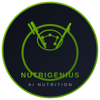

<div align="center">



# NutriGenius

**AI-Powered Personalized Nutrition & Wellness Platform**

Generate custom Indian diet plans, workout routines, and health insights powered by NVIDIA NIM AI.

[](https://reactjs.org/)
[](https://fastapi.tiangolo.com/)
[](https://build.nvidia.com/)
[](https://supabase.com/)
[](https://vercel.com/)

[](https://nutri-genius-mauve.vercel.app/)

</div>

---

## Features

| Feature | Description |
|---------|-------------|
| **Dashboard** | Personalized overview with BMI, TDEE, and calorie targets |
| **Macros Calculator** | AI-generated macro breakdown based on your goals |
| **Meal Prep** | Weekly meal prep guides with Indian recipes |
| **Regional Diet** | Diet plans customized to your regional cuisine |
| **Body Recomposition** | Lean mass gain and fat loss strategies |
| **Workout Plans** | AI-generated fitness routines |
| **Intermittent Fasting** | Customized fasting window recommendations |
| **Progress Tracking** | Analyze your fitness journey |
| **Lab Report Analysis** | Upload and understand your health reports |
| **Food Photo Analysis** | Computer vision to analyze your meals |
| **Supplement Guide** | Personalized supplement recommendations |
| **Health Plans** | Condition-specific wellness strategies |

---

## Tech Stack

<div align="center">

| Layer | Technology |
|-------|------------|
| **Frontend** | React 18, TypeScript, Vite |
| **Styling** | Custom CSS (Dark Theme) |
| **Backend** | Python 3.12, FastAPI |
| **AI Models** | NVIDIA NIM (Llama 3.3 70B + Vision) |
| **Database** | Supabase (PostgreSQL) |
| **Deployment** | Vercel |

</div>

---

## Quick Start

### Prerequisites

- Node.js 18+
- Python 3.12+
- NVIDIA API Key ([Get one here](https://build.nvidia.com/))
- Supabase Account ([Sign up free](https://supabase.com/))

### Installation

```bash
# Clone the repository
git clone https://github.com/devwithsujay/NutriGenius.git
cd NutriGenius

# Install backend dependencies
pip install -r api/requirements.txt

# Install frontend dependencies
cd frontend && npm install
```

### Environment Variables

Create a `.env` file in the `api/` directory:

```env
NVIDIA_API_KEY=your_nvidia_api_key
SUPABASE_URL=your_supabase_url
SUPABASE_KEY=your_supabase_anon_key
```

Create a `.env` file in the `frontend/` directory:

```env
VITE_SUPABASE_URL=your_supabase_url
VITE_SUPABASE_ANON_KEY=your_supabase_anon_key
```

### Run Locally

**Terminal 1 - Backend:**
```bash
uvicorn api.index:app --reload
```

**Terminal 2 - Frontend:**
```bash
cd frontend && npm run dev
```

Open [http://localhost:5173](http://localhost:5173) in your browser.

---

## Deployment

### Vercel

1. Push to GitHub
2. Import repository on [Vercel](https://vercel.com)
3. Add environment variables in Vercel dashboard
4. Deploy

---

## Project Structure

```
NutriGenius/
├── api/                    # FastAPI backend
│   ├── index.py           # Main application
│   └── requirements.txt   # Python dependencies
├── frontend/              # React frontend
│   ├── src/
│   │   ├── App.tsx        # Main application
│   │   ├── api.ts         # API helpers
│   │   └── supabase.ts    # Supabase client
│   └── package.json
├── vercel.json            # Vercel config
└── README.md
```

---

## How It Works

1. **Register/Login** - Create your account with Supabase Auth
2. **Set Profile** - Enter your body metrics and goals
3. **Generate Plans** - AI creates personalized recommendations
4. **Track Progress** - Save and review your health journey

---

## License

MIT License

---

<div align="center">

**Built with by Sujay**

</div>
